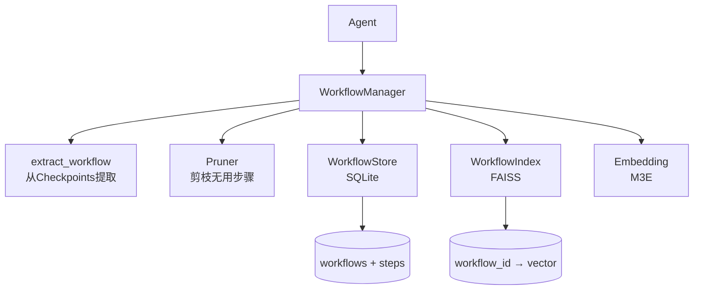

# WorkflowManager

基于 LangGraph 的 Workflow 提取与管理引擎。

**核心思想：`context = workflow`**

将 Agent 执行过程中的 toolcall/bashcall 步骤序列提取为结构化 Workflow，经过剪枝优化后固化，作为未来任务的优秀案例注入上下文。

## 与 Skill 的区别

Skill 是 Agent 自己总结的抽象描述，而 Workflow 是**真实的、可执行的步骤序列**——Agent 看到"上次解决这个问题用了这些步骤"，可以直接复用。

## 安装

```bash
pip install -r requirements.txt
```

依赖：`torch` `transformers` `faiss-cpu` `scikit-learn` `numpy` `langgraph` `langchain-core`
模型：需本地放置 [moka-ai/m3e-base](https://huggingface.co/moka-ai/m3e-base)（768维中文嵌入）

## 快速开始

```bash
python cli.py demo
```

## 核心概念

| 概念 | 说明 |
| ------ | ------ |
| **Workflow** | Agent 完成某项任务的有序 toolcall/bashcall 步骤序列（取代 Episode） |
| **Step** | 一次工具调用或命令执行，Workflow 的最小组成单元 |
| **RAW** | 任务完成后从 Checkpoints 提取的原始步骤序列 |
| **SOLIDIFIED** | 经过剪枝后的干净步骤序列，适合作为上下文注入 |

## 架构



## API

```python
from context_manager import WorkflowManager

wfm = WorkflowManager()

# 1. 提取 Workflow（任务完成后，从 LangGraph Thread 事后提取）
wf_id = wfm.extract_workflow("some_thread_id")

# 2. 固化（剪枝 + 索引）
wfm.solidify(wf_id)

# 3. 检索（返回完整 Workflow 结构，含步骤序列）
results = wfm.retrieve("如何修复导入错误", top_k=3)
# → [{"workflow_id", "name", "description", "similarity", "steps": [...]}]

# 4. 管理
wfm.list_workflows()
wfm.get_workflow(wf_id)
wfm.delete_workflow(wf_id)

wfm.close()
```

依赖注入（纯内存，测试用）：

```python
from context_manager import create_memory_manager

wfm = create_memory_manager()
```

## 项目结构

```bash
013ContextManager/
├── cli.py                         # 统一入口
├── context_manager/
│   ├── __init__.py                # 导出 WorkflowManager
│   ├── config.py                  # Settings dataclass
│   ├── embedding.py               # M3EEmbedding
│   ├── manager.py                 # WorkflowManager
│   ├── pruner.py                  # Pruner 剪枝引擎
│   ├── storage/
│   │   ├── base.py                # WorkflowStoreBase ABC
│   │   ├── in_memory.py           # MemoryWorkflowStore
│   │   └── sqlite.py              # SQLiteWorkflowStore
│   └── index/
│       ├── base.py                # WorkflowIndexBase ABC
│       ├── in_memory.py           # MemoryWorkflowIndex
│       └── faiss_index.py         # FaissWorkflowIndex
├── tests/                         # 22 个测试
├── docs/
│   └── RECALL.md                  # 完整设计文档
└── requirements.txt
```

## 运行测试

```bash
pytest tests/ -v   # 22 个测试
```

## 剪枝策略

| 策略 | 判断依据 | 示例 |
| ------ | --------- | ------ |
| **结果被覆盖** | 步骤 A 的输出被步骤 B 完全覆盖/修正 | `edit_file` 后又 `edit_file` 改同一文件 |
| **出错但无关** | 步骤执行失败，但后续通过其他方式解决了 | `pip install` 失败，`conda install` 成功 |
| **探索性调用** | 明显的探索/调试行为 | `ls`、`cat`、`read_file` 读无关文件 |
| **LLM 评判** | LLM 评估该步骤对最终结果无贡献 | 保留接口，第一版不实现 |
