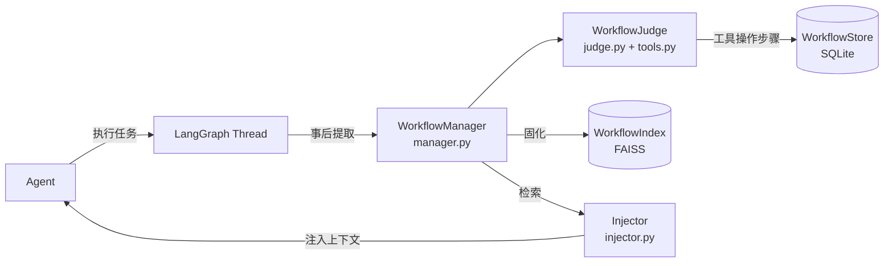

# WorkflowManager

基于 LangGraph 的 Workflow 提取与复用引擎。

[](https://www.python.org/)
[](https://langchain-ai.github.io/langgraph/)
[](LICENSE)

[English](./docs/README_EN.md) · **简体中文**

**核心思想：`context = workflow`**

Agent 完成任务的 toolcall/bashcall 步骤序列，经 **LLM 审查剪枝** 后固化为优秀案例，
下次遇到相似任务时检索并注入上下文——**省 token、少探索、快完成**。

## 为什么是 LLM 剪枝

规则剪枝只能识别已知工具名（`ls`/`cat`），真实 Agent 的探索行为藏在 `bash` 参数里、
失败路径、被覆盖的修改……规则全部漏掉。**WorkflowJudge（LLM 审查 Agent）通过 function call 工具操作 Workflow**：
识别探索性调用、失败但被绕过的尝试、结果被覆盖的修改，且能清理参数噪音（如失效路径 `cd /sandbox`）。

端到端评测（[docs/EvalReport.md](./docs/EvalReport.md)）显示：固定流程类任务注入后 **token 省 48%、工具调用省 52%**，
剪枝质量碾压规则剪枝（同任务注入 13537 vs 16653 tokens）。

## 安装

```bash
pip install -e .          # 或 pip install -r 依赖（见 pyproject.toml）
```

依赖：`torch` `transformers` `faiss-cpu` `scikit-learn` `numpy` `langgraph` `langchain-core`
模型：需本地放置 [moka-ai/m3e-base](https://huggingface.co/moka-ai/m3e-base)（768维中文嵌入），
路径在 `context_manager/config.py` 的 `Settings.model_path` 配置（默认 `C:/003Codes/models/m3e-base`）。

## 快速开始

```bash
python cli.py demo                  # ★ 完整样例：真实 Agent 任务 → 提取 → LLM 剪枝
                                    #   → 固化 → 检索 → 注入复用 → 对比省 token
                                    #   （需要 DEEPSEEK_API_KEY）
python cli.py demo --offline        # 离线演示（假数据，无需 API key）
python demo.py                      # 等价于 cli.py demo（完整样例可直接运行）
python cli.py review <thread_id>    # 一键审查：提取 → 展示 → 固化
python cli.py case                  # 内置案例：剪枝效果对比
python cli.py --list-tools          # 输出审查 LLM 的 function call schema
```

完整样例输出预览（`python cli.py demo`）：

```
1. 第一次执行 — Agent 无参考完成任务     → 9 次调用 / 8992 tokens
2. 提取 RAW Workflow（9 步，含探索噪音）
3. WorkflowJudge LLM 剪枝              → 剪 3 步（探索导航 + 失败验证）+ 审查报告
4. 固化 + 检索命中
5. 注入剪枝后工作流 → 第二次执行        → 8 次调用
6. 对比总结：调用/token/成功率 + 剪枝成本回本分析
```

## 核心概念

| 概念 | 说明 |
| --- | --- |
| **Workflow** | Agent 完成某项任务的有序 toolcall/bashcall 步骤序列 |
| **Step** | 一次工具调用或命令执行，Workflow 的最小组成单元 |
| **RAW** | 任务完成后从 Checkpoints 提取的原始步骤序列 |
| **SOLIDIFIED** | 经 LLM 剪枝后的干净步骤序列，适合作为上下文注入 |

## API

```python
from context_manager import WorkflowManager
from context_manager.workflow.judge import WorkflowJudge

wfm = WorkflowManager()

# 1. 提取（任务完成后，从 LangGraph Thread 事后提取）
wf_id = wfm.extract_workflow("some_thread_id")

# 2. LLM 剪枝（审查 Agent 通过工具操作步骤，返回统计与报告）
judge = WorkflowJudge(wfm, llm)          # llm: 支持 function calling 的 ChatOpenAI
result = judge.judge(wf_id)

# 3. 固化（生成描述 → 写入向量索引 → 标记 SOLIDIFIED）
wfm.solidify(wf_id)

# 4. 检索（返回过滤剪枝步骤后的 Workflow）
results = wfm.retrieve("如何修复导入错误", top_k=3)

# 5. 上下文注入（紧凑格式省 token）
from context_manager.workflow.injector import format_context_compact
context = format_context_compact(results[0])

# 6. 审查工具（LLM function call 用）
wfm.get_workflow(wf_id)
wfm.list_workflows()
wfm.prune_step("step_id", True)
wfm.update_workflow_description(wf_id, "new desc")

wfm.close()
```

依赖注入（纯内存，测试用）：

```python
from context_manager import create_memory_manager
wfm = create_memory_manager()
```

## 架构

```bash
context_manager/
├── __init__.py                 # 公共导出（WorkflowManager / WorkflowJudge / ...）
├── config.py                   # Settings（模型路径、存储路径、检索维度）
├── models.py                   # Workflow + Step 数据类
├── persistence/                # 持久化层
│   ├── store.py                # WorkflowStoreBase + SQLiteWorkflowStore + MemoryWorkflowStore
│   ├── index.py                # WorkflowIndexBase + FaissWorkflowIndex + MemoryWorkflowIndex
│   └── embedding.py            # M3EEmbedding（m3e-base 中文嵌入）
└── workflow/                   # 业务层
    ├── manager.py              # WorkflowManager：生命周期（提取/检索/注入/展示）
    ├── tools.py                # ReviewToolsMixin：17 个审查工具 + 自动生成 function schema
    ├── judge.py                # WorkflowJudge：LLM 剪枝审查 Agent（复用 tools）
    ├── injector.py             # 上下文注入格式化（详细/紧凑）
    └── visualizer.py           # ANSI 可视化
```



## LLM 剪枝（WorkflowJudge）

剪枝由 LLM 审查 Agent 完成，它只能通过 **function call 工具** 操作 Workflow，不能直接输出修改内容（防止幻觉）。
工具集由 `tools.py` 的 `get_tool_schemas()` **根据方法签名自动生成**（`inspect`），共 17 个：

| 类别 | 工具 |
| --- | --- |
| 查看 | `get_workflow` `list_workflows` `get_step` `list_steps` `get_steps` `visualize` |
| 操作 | `prune_step` `batch_prune` `update_step` `add_step` `remove_step` `reorder_steps` |
| 元数据 | `update_workflow_name` `update_workflow_description` |
| 生命周期 | `solidify` `delete_workflow` `review_summary` |
| 结束 | `judge_done(report)`（WorkflowJudge 内置，提交审查报告） |

LLM 审查标准：

| 标准 | 说明 |
| --- | --- |
| **探索性调用** | ls/dir/cat/read_file 读无关文件、pwd 等导航命令（含藏在 bash 参数内的） |
| **出错但无关** | 步骤执行失败，但后续通过其他方式解决了问题 |
| **结果被覆盖** | 同一文件/目标被多次修改，只保留最后一次有效修改 |
| **重复验证** | 同一验证命令多次成功运行，只保留最后一次 |
| **保留** | 有效的写操作、成功且关键的验证运行 |

## 评测（eval/）

真实 Agent 端到端评测（deepseek-chat + LangGraph ReAct + 4 个任务）：

```bash
python eval/runner.py --task all --mode both --runs 3   # 基线 vs LLM剪枝注入
python eval/report.py                                    # 生成评测报告
```

| 文件 | 说明 |
| --- | --- |
| `eval/agent.py` | Demo agent（bash/read/write/list 工具 + 统计） |
| `eval/tasks.py` | 4 个任务（导入错误/venv 搭建/批量重命名/修复测试） |
| `eval/runner.py` | 评测主脚本（baseline / inject 双模式） |
| `eval/report.py` | 结果汇总 → Markdown 报告 |

结论（[docs/EvalReport.md](./docs/EvalReport.md)）：**固定流程类任务复用收益显著**（token -48%），
简单任务无需注入；LLM 剪枝质量碾压规则剪枝，但剪枝成本（~15-18k tokens/次）需任务复用 4+ 次摊薄。

## 运行测试

```bash
pytest tests/ -v   # 36 个测试
```

## 项目结构

```bash
013ContextManager/
├── cli.py                         # 统一入口（demo / review / list-tools）
├── context_manager/               # 核心库
├── eval/                          # 端到端评测
├── tests/                         # 36 个测试
├── docs/
│   ├── Design.md                  # 完整设计文档
│   ├── EvalReport.md              # 省 Token 评测报告
│   └── README_EN.md               # English
├── pyproject.toml                 # 打包与依赖
└── LICENSE
```

## 审查流程

```bash
python cli.py review <langgraph_thread_id>
```

1. 从 LangGraph Thread 提取 RAW Workflow
2. 展示步骤摘要
3. WorkflowJudge LLM 剪枝（工具审查：探索性、失败、被覆盖、重复验证）
4. 固化 SOLIDIFIED + 写入 FAISS 索引
