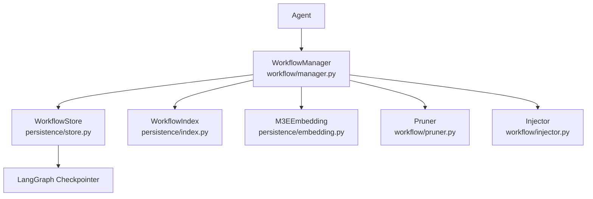
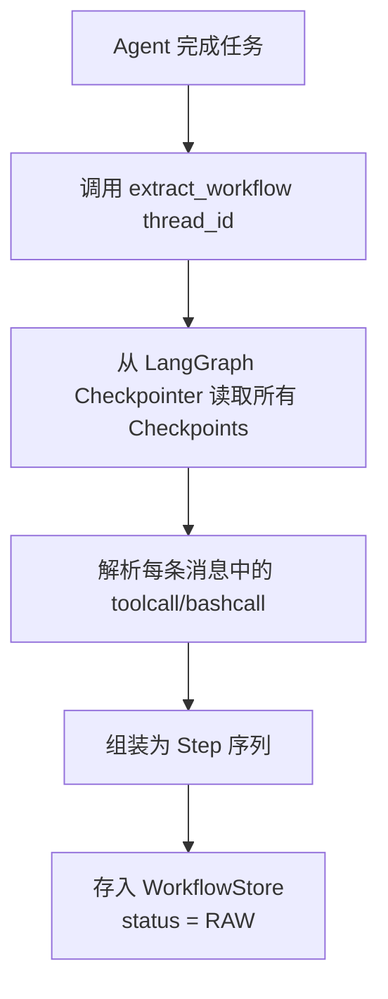
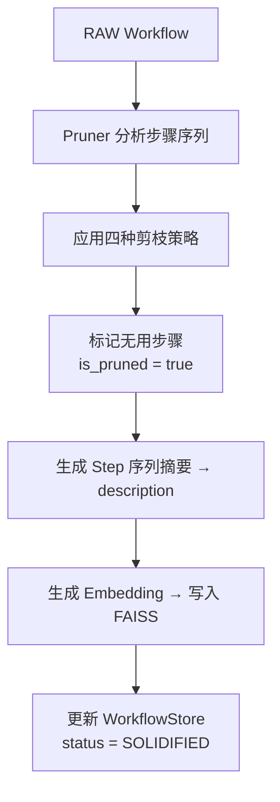
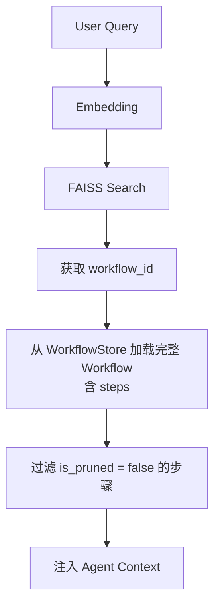
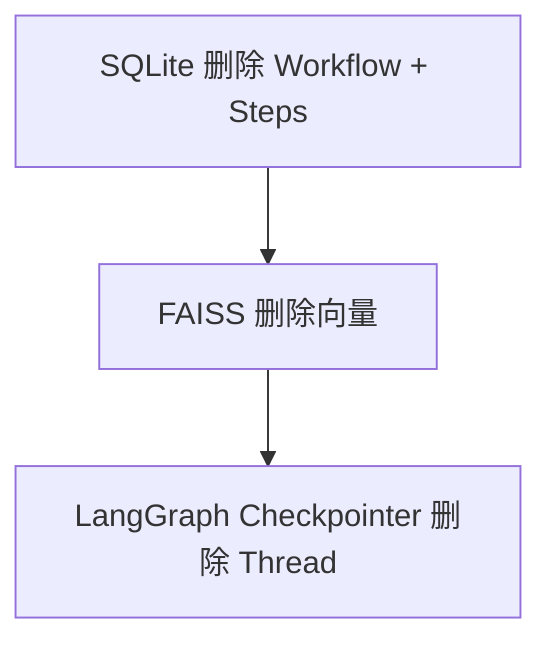

# WorkflowManager Design Document

## 1. 项目概述

### 1.1 背景

随着 LLM Agent 长时间运行，会产生大量工具调用（toolcall/bashcall）记录。传统 Context Window 无法承载全部历史，且现有方案（如简单 Memory 系统）只管理 Thread 级别的元数据，不理解 Agent 内部的工作步骤。

WorkflowManager 的目标：

> 将 Agent 执行过程中的 toolcall/bashcall 步骤序列提取为结构化 Workflow，经过剪枝优化后固化，作为未来任务的优秀案例注入上下文。

### 1.2 与 Skill 的区别

现有 Agent 的 "skill" 机制是 Agent 自己总结的抽象描述，而 Workflow 是**真实的、可执行的步骤序列**，具备极强的参考价值——Agent 看到"上次解决这个问题用了这些步骤"，可以直接复用。

---

## 2. 核心设计原则

### 2.1 事后处理

不实时监听步骤。任务完成后，从 LangGraph Checkpoints 中一次性提取步骤序列。

### 2.2 Context = Workflow

核心思想：一个任务的上下文 = 它的工作流。Workflow 取代传统的 Episode 概念。

### 2.3 剪枝即提炼

原始步骤序列包含大量噪音（探索性调用、失败尝试、被覆盖的修改），通过剪枝策略提炼出干净的 SOLIDIFIED Workflow。

### 2.4 简洁优先

不提前引入：

- Graph RAG
- 复杂关系网络
- 多层 Memory
- Branch 系统
- Workflow 版本管理

---

## 3. 核心概念

### 3.1 Workflow（取代 Episode）

Workflow 是 Agent 完成某项任务时，经历的有序 toolcall/bashcall 步骤序列。

```python
Workflow = {
  workflow_id: str,
  name: str,
  description: str,
  steps: Step[],
  status: "RAW" | "SOLIDIFIED",
  source_thread_id: str,
  created_at: datetime,
  updated_at: datetime,
  tags: str[],
}
```

### 3.2 Step

Step 是 Agent 的一次工具调用或命令执行，是 Workflow 的最小组成单元。

```python
Step = {
  step_id: str,
  type: "toolcall" | "bashcall",
  name: str,
  arguments: str,
  result: str,
  status: "success" | "failure",
  duration_ms: int,
  timestamp: datetime,
  step_index: int,
  is_pruned: bool,
  error_message: str | null,
}
```

### 3.3 RAW vs SOLIDIFIED

| 状态 | 说明 |
| --- | --- |
| **RAW** | 任务完成后从 Checkpoints 提取的原始步骤序列，包含所有探索性、调试性、失败的调用 |
| **SOLIDIFIED** | 经过剪枝后的干净步骤序列，只保留对任务有贡献的核心步骤，适合作为上下文注入 |

---

## 4. 系统架构

```bash
context_manager/
├── models.py                    # Workflow + Step 数据类（顶层共享）
├── persistence/                 # 持久化层
│   ├── store.py                 # WorkflowStoreBase + SQLite + InMemory
│   ├── index.py                 # WorkflowIndexBase + FAISS + InMemory
│   └── embedding.py             # M3EEmbedding
└── workflow/                    # Workflow 管理（RAG API）
    ├── manager.py               # WorkflowManager（提取、剪枝、检索、编辑）
    ├── pruner.py                # 规则剪枝引擎
    └── injector.py              # 上下文注入
```



---

## 5. 组件设计

### 5.1 WorkflowManager

位于 `workflow/manager.py`，统一入口，管理 Workflow 生命周期。

职责：

- `extract_workflow(thread_id)` → 任务完成后从 Checkpoints 提取步骤
- `solidify(workflow_id)` → 对 RAW workflow 执行剪枝，生成 SOLIDIFIED
- `retrieve(query, top_k)` → 检索相关 Workflow，返回 `Workflow` 对象列表
- `format_context(workflow)` → 将 Workflow 格式化为 Agent 上下文注入文本
- 审查 LLM 工具：`get_workflow`、`list_workflows`、`prune_step`、`update_workflow_description`、`delete_workflow`

### 5.2 WorkflowStore

位于 `persistence/store.py`，持久化 Workflow + Step 元数据。

Schema：

```sql
CREATE TABLE workflows (
    workflow_id     TEXT PRIMARY KEY,
    name            TEXT NOT NULL,
    description     TEXT DEFAULT '',
    status          TEXT DEFAULT 'RAW',
    source_thread_id TEXT,
    tags            TEXT DEFAULT '',
    created_at      TEXT NOT NULL,
    updated_at      TEXT NOT NULL
);

CREATE TABLE steps (
    step_id         TEXT PRIMARY KEY,
    workflow_id     TEXT NOT NULL,
    step_index      INTEGER NOT NULL,
    type            TEXT NOT NULL,
    name            TEXT NOT NULL,
    arguments       TEXT DEFAULT '',
    result          TEXT DEFAULT '',
    status          TEXT DEFAULT 'success',
    duration_ms     INTEGER DEFAULT 0,
    error_message   TEXT DEFAULT '',
    is_pruned       INTEGER DEFAULT 0,
    timestamp       TEXT NOT NULL,
    FOREIGN KEY (workflow_id) REFERENCES workflows(workflow_id)
);
```

### 5.3 WorkflowIndex

向量索引 Workflow 用于检索。

- 索引对象：`workflow_id → workflow_description`
- 使用 FAISS IndexFlatIP（余弦相似度）
- 检索返回整个 Workflow 结构

### 5.4 Pruner

剪枝引擎，将 RAW Workflow 转化为 SOLIDIFIED。

四种剪枝策略：

| 策略 | 判断依据 | 示例 |
| --- | --- | --- |
| **结果被覆盖** | 步骤 A 的输出被步骤 B 完全覆盖/修正 | `edit_file` 后又 `edit_file` 改同一文件 |
| **出错但无关** | 步骤执行失败，但后续通过其他方式解决了 | `pip install` 失败，`conda install` 成功 |
| **LLM 评判** | LLM 评估该步骤对最终结果无贡献 | 探索性 `read_file` 读了无关文件 |
| **探索性调用** | 明显的探索/调试行为，非最终方案的一部分 | `ls`、`cat`、`print` 调试 |

### 5.5 LangGraph Checkpointer

保留，用于管理 Thread 状态和 Checkpoints。

### 5.6 Injector

位于 `workflow/injector.py`，负责将 Workflow 格式化为适合注入 Agent 上下文的文本。

两种格式：

- `format_context()` → 详细格式，含步骤名、参数、结果摘要
- `format_context_compact()` → 紧凑格式，仅步骤名和参数摘要，适合 Token 敏感场景

---

## 6. Workflow 生命周期

### 6.1 创建 RAW Workflow



### 6.2 固化 Workflow



### 6.3 检索



### 6.4 删除



---

## 7. 上下文注入格式

检索到的 Workflow 以结构化格式注入 Agent 上下文：

```workflow
[参考 Workflow: 上次修复 Python 导入错误的步骤]
Step 1:  read_file("src/imports.py")           → 查看导入语句
Step 2:  bash("python -c 'import module_x'")   → 验证导入
Step 3:  edit_file("src/imports.py", ...)       → 修正导入路径
Step 4:  bash("python -c 'import module_x'")   → 验证通过
```

---

## 8. 数据一致性

- SQLite 是 Workflow 元数据的真相源
- LangGraph 是执行状态的真相源
- FAISS 索引可以从 SQLite 重建

---

## 9. 第一版不实现

- 多 Agent 共享 Workflow 库
- Workflow 版本管理
- Workflow 合并/拆分
- Workflow 可视化 UI
- 自动标签生成（先用简单规则）
- LLM 评判剪枝（先用规则剪枝）
