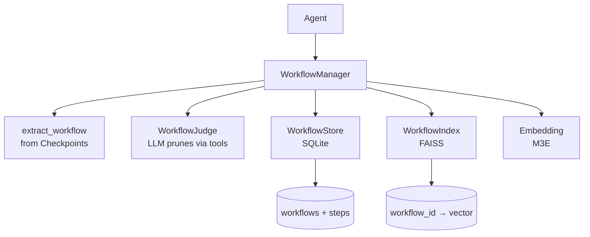

# WorkflowManager

**Extract, prune, and solidify LLM agent workflows from LangGraph checkpoints.**

[](https://www.python.org/)
[](https://langchain-ai.github.io/langgraph/)
[](LICENSE)

**Core idea: `context = workflow`**

Instead of treating agent execution history as raw message dumps, WorkflowManager extracts structured **toolcall/bashcall step sequences** from LangGraph checkpoints, prunes out noise, and solidifies them into reusable workflows. When a similar task arises, the solidified workflow is injected as context — giving the agent a proven recipe to follow.

---

## Why Workflow?

| Aspect | Traditional Skill | Workflow |
| -------- | ------------------- | ---------- |
| **Nature** | Abstract description by the agent | Real, executable step sequence |
| **Granularity** | High-level summary | Step-by-step tool/bash calls |
| **Reference value** | Conceptual guide | Directly reusable pattern |
| **Example** | "Fix import errors by checking paths" | `read_file → grep → edit_file → python` |

An agent seeing a workflow knows **exactly what steps to take** — not just a vague idea.

---

## How It Works



### Lifecycle

```
1. Agent completes a task (LangGraph Thread)
2. extract_workflow(thread_id)  →  parse messages into Step[], store as RAW
3. judge.judge(workflow_id)     →  LLM review agent prunes steps via function calls
4. solidify(workflow_id)        →  generate description → index via FAISS → status = SOLIDIFIED
5. retrieve(query)              →  embed query → FAISS search → return SOLIDIFIED workflow with steps
```

---

## Quick Start

```bash
pip install -e .
python cli.py demo
```

**Dependencies**: `torch` `transformers` `faiss-cpu` `scikit-learn` `numpy` `langgraph` `langchain-core`

**Model**: Download [moka-ai/m3e-base](https://huggingface.co/moka-ai/m3e-base) (768-dim Chinese embedding) to `models/` directory.

---

## API

```python
from context_manager import WorkflowManager

wfm = WorkflowManager()

# 1. Extract workflow from a completed LangGraph thread
wf_id = wfm.extract_workflow("some_thread_id")

# 2. Solidify (prune + index)
wfm.solidify(wf_id)

# 3. Retrieve relevant workflows (returns complete step sequences)
results = wfm.retrieve("how to fix import error", top_k=3)
# → [{"workflow_id", "name", "description", "similarity", "steps": [...]}]

# 4. Management
wfm.list_workflows()
wfm.get_workflow(wf_id)
wfm.delete_workflow(wf_id)

wfm.close()
```

For testing with in-memory backends:

```python
from context_manager import create_memory_manager

wfm = create_memory_manager()
```

---

## Core Concepts

| Concept | Description |
| --------- | ------------- |
| **Workflow** | Ordered sequence of toolcall/bashcall steps (replaces Episode) |
| **Step** | A single tool call or bash command execution |
| **RAW** | Raw step sequence extracted from checkpoints, including noise |
| **SOLIDIFIED** | Clean, pruned step sequence ready for context injection |

### Step Schema

```python
Step = {
  step_id: str,
  type: "toolcall" | "bashcall",
  name: str,              # e.g. "read_file", "edit_file", "python"
  arguments: str,         # full input parameters
  result: str,            # full output
  status: "success" | "failure",
  duration_ms: int,
  timestamp: datetime,
  step_index: int,
  is_pruned: bool,        # marked by WorkflowJudge (LLM)
  error_message: str | null,
}
```

---

## LLM Pruning (WorkflowJudge)

Pruning is done by an LLM review agent (`workflow/judge.py`) that operates the workflow **only through function-call tools** (preventing hallucinated edits):

| Category | Tools |
| ---------- | ------- |
| View | `review_summary` `list_steps` `get_steps` `get_step` `visualize` |
| Edit | `prune_step` `batch_prune` `update_step` `add_step` `remove_step` `reorder_steps` |
| Metadata | `update_workflow_description` |
| Finish | `judge_done(report)` |

Review criteria: exploratory calls (incl. inside `bash` args), failed-and-bypassed steps, overwritten results, repeated verifications are pruned; effective writes and successful verifications are kept.

---

## Project Structure

```bash
013ContextManager/
├── cli.py                         # CLI entry point
├── context_manager/
│   ├── __init__.py                # Exports WorkflowManager, WorkflowJudge
│   ├── config.py                  # Settings dataclass
│   ├── models.py                  # Workflow + Step dataclasses
│   ├── persistence/
│   │   ├── store.py               # WorkflowStoreBase + SQLite + InMemory
│   │   ├── index.py               # WorkflowIndexBase + FAISS + InMemory
│   │   └── embedding.py           # M3EEmbedding
│   └── workflow/
│       ├── manager.py             # WorkflowManager (lifecycle: extract/retrieve/inject)
│       ├── tools.py               # ReviewToolsMixin (17 tools + auto-generated schemas)
│       ├── judge.py               # WorkflowJudge (LLM pruning agent, reuses tools)
│       ├── injector.py            # Context injection formatting
│       └── visualizer.py          # ANSI visualization
├── eval/                          # End-to-end token-saving evaluation
│   ├── agent.py                   # Demo agent (bash/read/write/list + stats)
│   ├── tasks.py                   # 4 benchmark tasks
│   ├── runner.py                  # Eval runner (baseline vs LLM-pruned injection)
│   └── report.py                  # Results → Markdown report
└── pyproject.toml                 # Packaging & dependencies
```

---

## Running Tests

```bash
pytest tests/ -v    # 36 tests
```

---

## Database Schema

```sql
CREATE TABLE workflows (
    workflow_id     TEXT PRIMARY KEY,
    name            TEXT NOT NULL,
    description     TEXT DEFAULT '',
    status          TEXT DEFAULT 'RAW',
    source_thread_id TEXT,
    tags            TEXT DEFAULT '',
    created_at      TEXT NOT NULL,
    updated_at      TEXT NOT NULL
);

CREATE TABLE steps (
    step_id         TEXT PRIMARY KEY,
    workflow_id     TEXT NOT NULL,
    step_index      INTEGER NOT NULL,
    type            TEXT NOT NULL,
    name            TEXT NOT NULL,
    arguments       TEXT DEFAULT '',
    result          TEXT DEFAULT '',
    status          TEXT DEFAULT 'success',
    duration_ms     INTEGER DEFAULT 0,
    error_message   TEXT DEFAULT '',
    is_pruned       INTEGER DEFAULT 0,
    timestamp       TEXT NOT NULL,
    FOREIGN KEY (workflow_id) REFERENCES workflows(workflow_id)
);
```

---

## Out of Scope (v1)

- Multi-agent shared workflow library
- Workflow versioning
- Workflow merge/split
- Workflow visualization UI
- Auto tag generation (simple rules for now)

---

## Data Consistency

- **SQLite** is the source of truth for workflow metadata
- **LangGraph** is the source of truth for execution state
- **FAISS index** can be rebuilt from SQLite at any time
